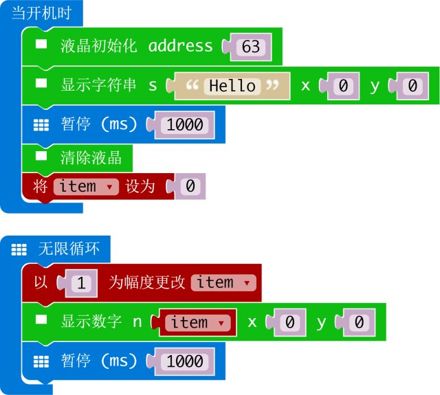

# I2C液晶1602

makecode I2C 液晶 1602 扩展  

作者: shaoziyang  
日期: 2018.Mar  

  


## 添加扩展

打开 makecode 编辑器，在项目中选择扩展，然后在地址栏输入下面网址  

https://github.com/makecode-packages/I2CLCD1620_cn  

搜索后就可以添加并使用扩展了。

## 基本用法
```
let item = 0
OLED12864_I2C.init(60)
item = 0
basic.forever(() => {
    OLED12864_I2C.showNumber(0, 0, item, 1)
    item += 1
    basic.pause(1000)
}) 
```

## I2C 地址
有两种I2C液晶模块，它们的地址不相同：    
- 39: PCF8574  
- 63: PCF8574A  

如果将地址设置为0，扩展会自动搜索并识别正确的地址
- 0：自动地址模式

## API

- **LcdInit**(address: number)  
初始化 LCD  
address: I2C 地址  
 0: 自动识别地址  
 39: PCF8574  
 63: PCF8574A

- **ShowNumber**(n: number, x: number, y: number)  
在液晶的指定位置显示数字。  
n: 数字  
x: 液晶X轴坐标, [0 - 15]  
y: 液晶Y轴坐标, [0 - 1]  

- **ShowString**(s: string, x: number, y: number)  
在液晶指定位置显示字符串show a string in LCD at given position.  
s: 将要显示的英文字符串  
x: 液晶X轴坐标, [0 - 15]  
y: 液晶Y轴坐标, [0 - 1]  

- **on**()  
打开液晶的显示功能

- **off**()  
关闭液晶  

- **clear**()  
清除液晶显示的内容  

- **BacklightOn**()  
打开液晶的背光灯  

- **BacklightOff**()  
关闭液晶的背光灯  

- shl()
屏幕向左移动

- shr()
屏幕向右移动 

## 演示



## 授权方式

MIT

microbit/micropython 中文社区版权所有 (c) 2018  

## 支持硬件

* for PXT/microbit


[来自 microbit/micropython 中文社区](http://www.micropython.org.cn)
